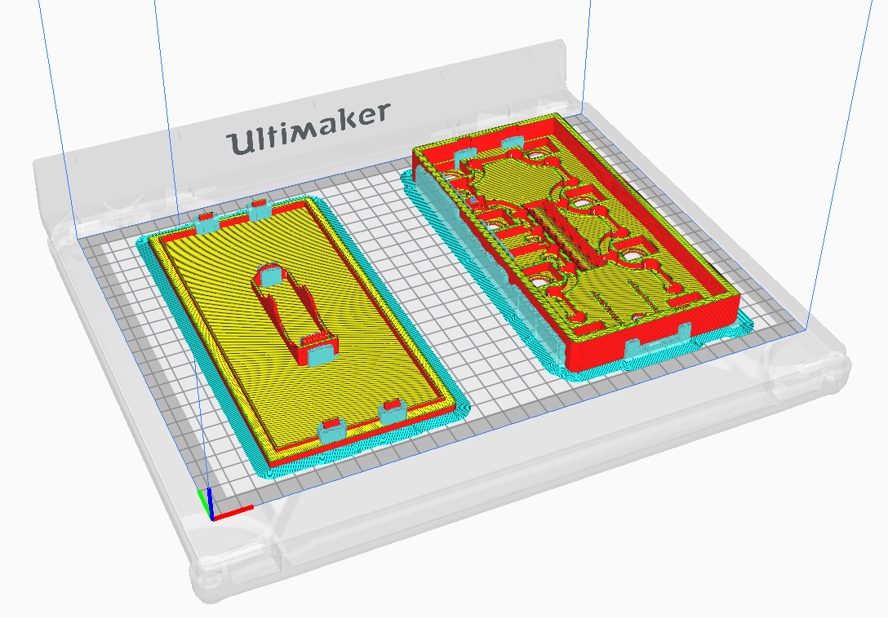

# PedalinoMini-Case-1

The scope of this project is to create a case for PedalinoMini™. The main goals are:

- Printable with a 3D printer
- Using standard off-the-shelf components
- Easy to assembly
- Look nice

Main features:

 - Compact form factor (20 x 10 x 2.6 cm)
 - 8 footswitches
 - MIDI IN and MIDI OUT ports
 - 2 TRS ports for connect external pedals like Boss FS-5U (1 footswitch), Boss FS-6 (2 footswitches), Digitech FS3X (3 footswitches), TC-Helicon Switch 6 (6 footswitches) or expression pedals.

The following images are a sneak preview.

Are you interested? Sponsors will receive the files once released first.

