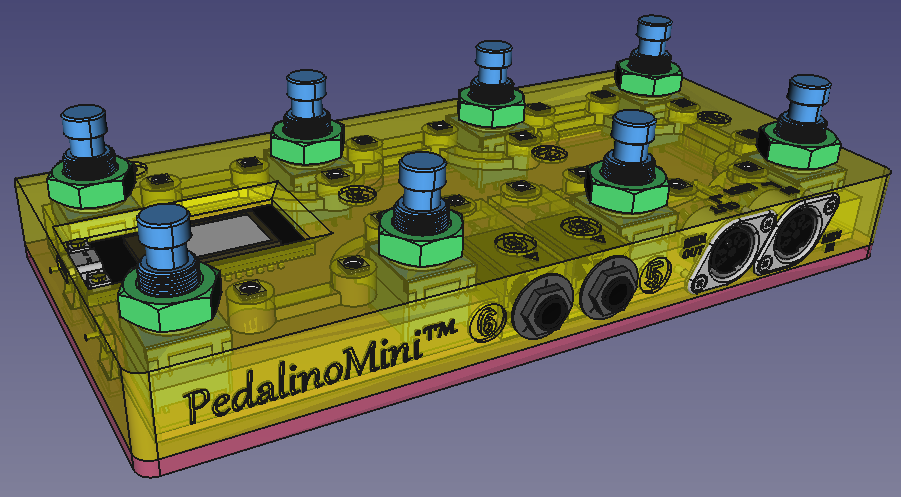
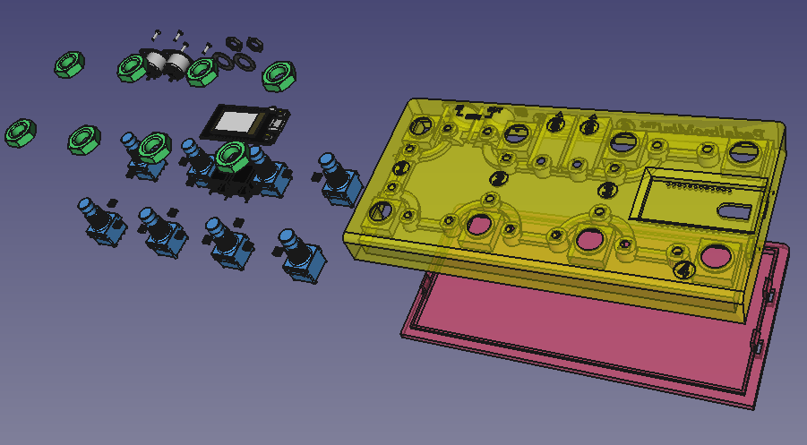
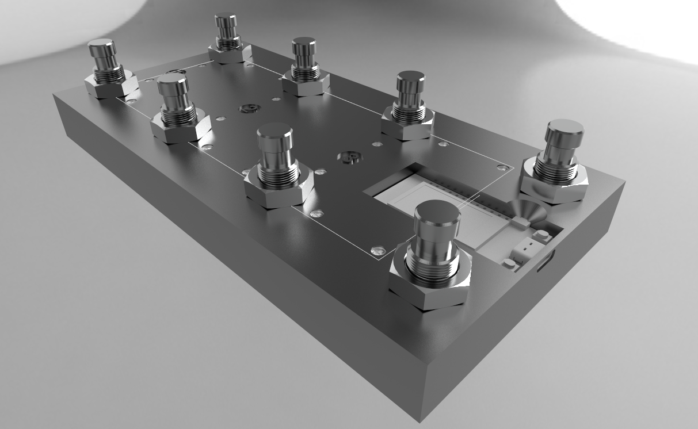
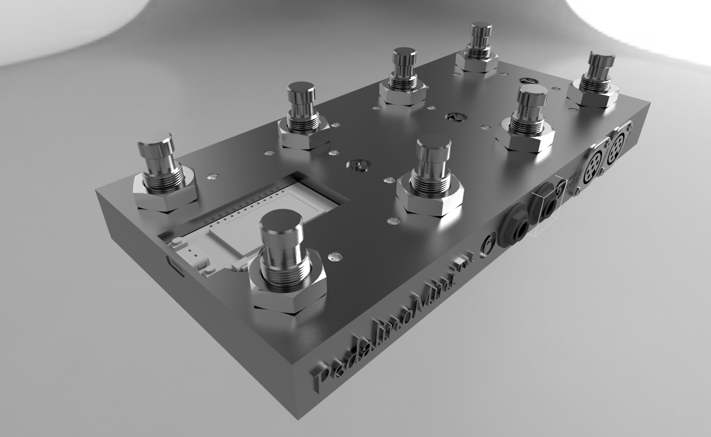
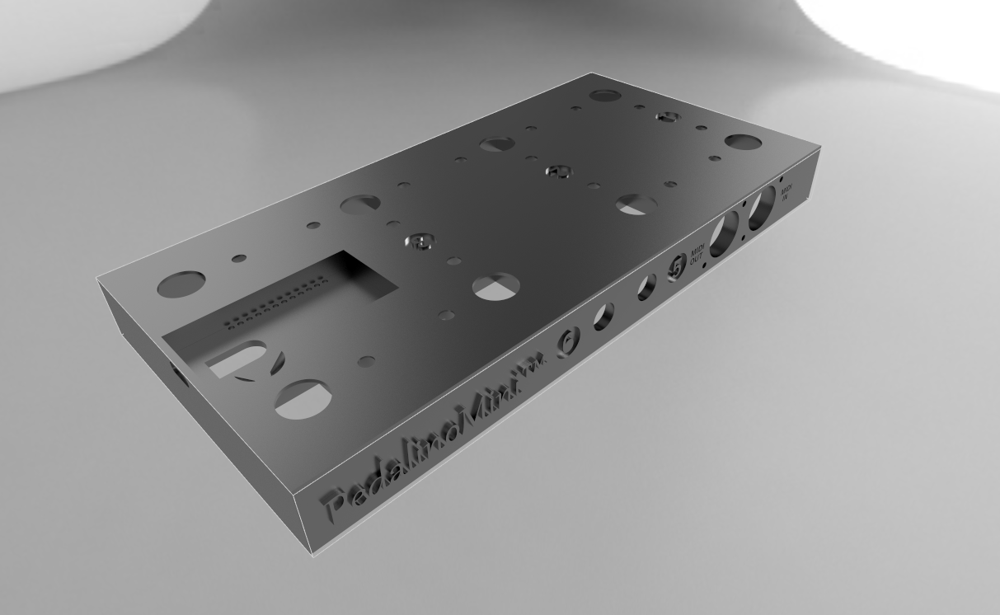
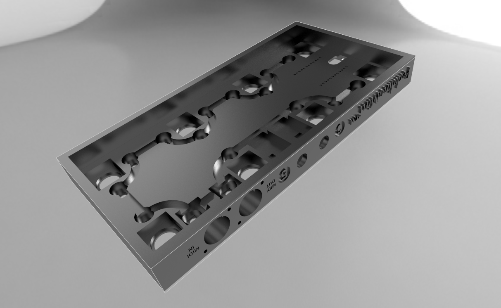

# PedalinoMini-Case-1

The scope of this project is to create a case for PedalinoMini™. The main goals are:

- Printable with a 3D printer
- Using standard off-the-shelf components
- Easy to assembly
- Look nice

The following images are a sneak preview.

Are you interested? Sponsors will receive the files once released first.

