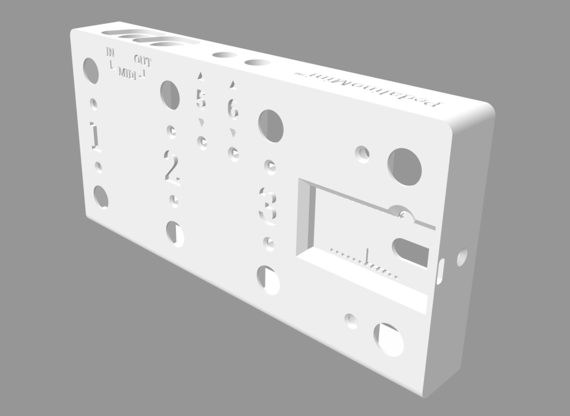

# PedalinoMini™ Case 1

The scope of this project is to create a case for [PedalinoMini™](https://github.com/alf45tar/PedalinoMini). The goals are:

- Printable with a 3D printer
- Using standard off-the-shelf components
- Easy to assembly
- Look nice

Main features:

 - Compact form factor (20 x 10 x 2.6 cm)
 - 8 footswitches
 - Battery powered with one 18650 3.7V Li-ion lithium battery
 - MIDI IN and MIDI OUT ports
 - 2 TRS expansion ports to connect external foot switches or expression pedals.

PedalinoMini™ Case 1 is available to sponsors only [here](https://github.com/pedalino-sponsors/PedalinoMini/tree/main/case1).

If dimensions do not fit for you, custom versions are available [here](https://github.com/sponsors/alf45tar/sponsorships?sponsor=alf45tar&tier_id=69721&preview=false)

